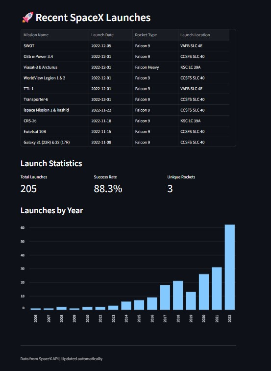

# SpaceX Launch Tracker

A simple Streamlit dashboard tracking SpaceX rocket launches.

## Features
- Shows latest 10 launches
- Launch statistics
- Success/failure indicators
- Launches by year chart

## How to Run
1. Install requirements: `pip install -r requirements.txt`
2. Run the app: `streamlit run app.py`